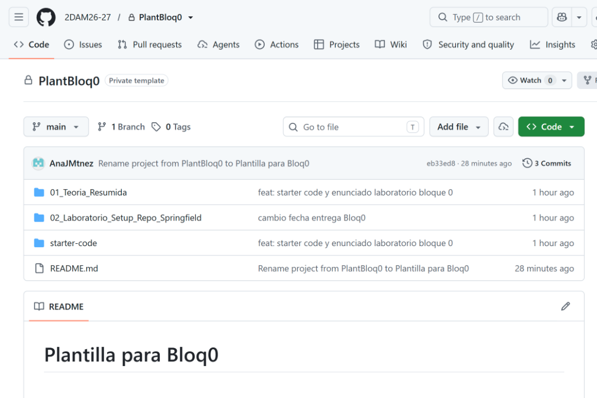

# Enunciado Lab 0: Setup Inicial desde Plantilla de GitHub (`PlantBloq0`) & Laboratorio AWS
## Nivel 0: Operario del Sector 7-G | Fecha Límite de Entrega: 30 de Septiembre de 2026 (23:59h)
**Módulo**: Sistemas de Gestión Empresarial (SGE - 2º DAM) | Curso 2026-2027  
**Centro**: IES Poeta Paco Mollá (Petrer, Alicante)  
**Profesora**: Ana J. Martínez Montesinos (`aj.martinezmontesi@edu.gva.es` / GitHub: `AnaJMtnez`)  

---

## 1. Contexto de la Misión
¡Bienvenido a Springfield! Has sido contratado como Ingeniero de Sistemas Junior para ayudar a digitalizar la **Fábrica de Cerveza Duff** y el **Badulaque de Apu**. Antes de abordar los servidores de producción de Odoo, debes preparar tu puesto de trabajo local y conectar tu cuenta del **Learner Lab de AWS Academy ($50 USD)** de la asignatura optativa OPT-CLOUD.

Para facilitar el inicio del curso y estandarizar la entrega de las prácticas, la docente ha preparado un **repositorio plantilla en GitHub** que servirá como punto de partida oficial. Tu tarea consistirá en **generar tu repositorio personal a partir de dicha plantilla y modificarlo/evolucionarlo** para adaptarlo a los requisitos completos de la práctica.

---

## 2. Objetivos de Aprendizaje
1. Crear tu propio repositorio Git privado utilizando como base el repositorio plantilla oficial de la organización: **`2DAM26-27/PlantBloq0`**.
2. **Modificar y personalizar la plantilla**: transformar el `README.md` inicial ("Plantilla para Bloq0"), crear el archivo `.gitignore` y estructurar el espacio de trabajo para el curso.
3. Verificar que tu entorno local cuenta con **Python 3.10+**, **Docker CLI** y **Docker Compose v2** funcionales mediante el script `starter-code/check_springfield_env.py`.
4. Lanzar y configurar una máquina virtual EC2 (Ubuntu 22.04 LTS / 24.04 LTS) en el Learner Lab de AWS Academy con el Security Group adecuado (puertos 22, 80, 8069, 8072) y rol `LabRole`.
5. Redactar y entregar la **Mini-Guía 0 en doble formato obligatorio: `.pdf` y `.docx`**, adjuntando evidencias de ejecución.

---

## 3. Punto de Partida: La Plantilla Oficial en GitHub (`PlantBloq0`)

En la organización oficial de la clase en GitHub se encuentra la plantilla base privada **`PlantBloq0`**:

👉 **Repositorio Plantilla**: [https://github.com/2DAM26-27/PlantBloq0](https://github.com/2DAM26-27/PlantBloq0)



Como se aprecia en la captura superior, la plantilla contiene inicialmente:
```text
2DAM26-27 / PlantBloq0 (Template inicial)
├── 01_Teoria_Resumida/                   # Resumen teórico de Python, Docker y AWS
├── 02_Laboratorio_Setup_Repo_Springfield/ # Enunciado del laboratorio y recursos
├── starter-code/                         # Scripts de verificación y parada FinOps
└── README.md                             # "Plantilla para Bloq0" (título provisional a cambiar)
```

---

## 4. Tareas Detalladas a Realizar

### Tarea 1: Generar tu Repositorio Privado desde la Plantilla
1. Inicia sesión en GitHub con tu cuenta educativa de alumno.
2. Accede a la plantilla oficial: [https://github.com/2DAM26-27/PlantBloq0](https://github.com/2DAM26-27/PlantBloq0).
3. Haz clic en el botón verde superior **"Use this template"** y selecciona **"Create a new repository"**.
4. Configura los parámetros requeridos:
   - **Owner**: Tu usuario personal de GitHub.
   - **Repository name**: `sge-springfield-apellidos-nombre` *(en minúsculas, sin tildes ni espacios)*.
   - **Description**: `Sistemas de Gestión Empresarial (SGE 2º DAM) - Springfield 2.0 (Duff & Badulaque)`.
   - **Visibility**: **Private** (⚠️ *Obligatorio: el repositorio debe ser estrictamente privado*).
   - Deja **desmarcada** la casilla *Include all branches* (solo necesitamos la rama `main`).
5. Pulsa en **"Create repository"**.
6. **Invitar a la profesora como colaboradora**:
   - Entra en tu nuevo repositorio recién creado.
   - Ve a la pestaña **Settings** > **Collaborators** > botón **Add people**.
   - Busca e invita a la docente: usuario de GitHub **`AnaJMtnez`** o correo **`aj.martinezmontesi@edu.gva.es`**.
7. **Clonar el repositorio en tu ordenador**:
   - Abre tu terminal (PowerShell o Git Bash) y clona tu repositorio en tu carpeta de prácticas:
     ```bash
     git clone https://github.com/TU_USUARIO/sge-springfield-apellidos-nombre.git
     cd sge-springfield-apellidos-nombre
     ```

---

### Tarea 2: Modificar y Adaptar la Plantilla a los Requisitos de la Práctica
El repositorio recién clonado contiene el formato inicial de la plantilla. Debes realizar las siguientes modificaciones para que se ajuste a lo exigido en el módulo:

#### A. Personalizar el `README.md` (Eliminar "Plantilla para Bloq0")
Abre el archivo `README.md` en tu editor de código (Visual Studio Code) y sustituye el título provisional por una portada profesional para tu portafolio:
- **Título principal**: `# SGE 2º DAM - Operación Springfield 2.0 (Fábrica Duff y Badulaque)`
- **Datos del Estudiante**:
  - Alumno/a: [Tus nombres y apellidos]
  - Centro: IES Poeta Paco Mollá (Petrer, Alicante)
  - Curso: 2º DAM Presencial - Año Académico 2026-2027
  - Módulo: Sistemas de Gestión Empresarial (0491)
- **Panel de Insignias / Logros de Springfield**:
  - Incorpora una tabla o lista con tu progreso de gamificación, marcando como desbloqueada tu primera insignia:
    - 🎖️ **"Operario del Sector 7-G" (Nivel 0)**: *Entorno de desarrollo verificado y setup completado.*
- **Sección AWS Academy Learner Lab ($50 USD)**:
  - Anota el estado de tu laboratorio en la nube (ID de la instancia EC2, IP pública elástica asignada y saldo restante en Vocareum).
- **Índice de Contenidos del Repositorio**.

#### B. Crear el archivo `.gitignore`
Para evitar subir accidentalmente contraseñas, claves privadas de AWS o ficheros temporales, crea en la raíz del repositorio el archivo `.gitignore` con el siguiente contenido mínimo:
```gitignore
# Claves privadas SSH de AWS Academy (¡CRÍTICO: nunca subir claves a GitHub!)
*.pem
*.ppk
vockey*

# Ficheros temporales y caché de Python
__pycache__/
*.py[cod]
*$py.class
*.env
.venv/
env/

# Ficheros del sistema operativo y volcados pesados
.DS_Store
Thumbs.db
*.dump
*.sql
*.tar.gz
```

#### C. Estructurar y Completar las Carpetas del Repositorio
A partir de la estructura que te ha proporcionado la plantilla, prepara las carpetas para alojar este laboratorio y los bloques posteriores:
1. **Conservar `01_Teoria_Resumida/`**: Para almacenar tus apuntes y resúmenes de clase.
2. **En `02_Laboratorio_Setup_Repo_Springfield/`**:
   - Es la carpeta de entrega de este Lab 0.
   - Aquí guardarás:
     - **`MiniGuia_Mision0.pdf`** *(Obligatorio)*.
     - **`MiniGuia_Mision0.docx`** *(Obligatorio)*.
     - Captura de pantalla de la salida del script de verificación.
     - Captura de pantalla de tu instancia activa en la consola de AWS.
3. **Crear la carpeta `aws_learner_lab/`**:
   - Para guardar scripts de apoyo como `aws_budget_guard.sh`, notas de conexión por SSH y recordatorios FinOps para apagar la máquina y no agotar los 50 dólares.
4. **Crear la carpeta `03_Proyecto_Integrador_Final/`**:
   - Con un archivo `.gitkeep` para que Git la registre, quedando lista para el cierre de curso en febrero.

---

### Tarea 3: Lanzamiento y Configuración de AWS Academy Learner Lab ($50 USD)
1. Inicia sesión en el portal de **AWS Academy / Vocareum Learner Lab** y pulsa el botón verde **"Start Lab"**.
2. Despliega la pestaña **AWS Details** y descarga tu clave privada **`vockey.pem`**. Guárdala en una carpeta segura fuera del repositorio o asegúrate de que `.gitignore` la oculte.
3. Haz clic en el enlace rojo **"AWS"** para abrir la consola de administración de Amazon Web Services.
4. Lanza una nueva instancia **Amazon EC2**:
   - **Name**: `Odoo-Springfield-TuNombre`
   - **AMI**: *Ubuntu Server 22.04 LTS* o *24.04 LTS* (64-bit x86 o ARM Graviton).
   - **Instance Type**: `t3.small` (Recomendada: 2 vCPU, 2 GiB RAM) o `t3.medium`.
   - **Key pair**: Selecciona `vockey`.
   - **Network settings / Security Group**: Crea un grupo de seguridad (`sg-springfield-odoo`) con las siguientes reglas de entrada:
     - SSH (TCP 22) desde tu IP o cualquier origen.
     - HTTP (TCP 80) desde `0.0.0.0/0`.
     - Custom TCP (TCP 8069) desde `0.0.0.0/0` (Puerto de Odoo Web).
     - Custom TCP (TCP 8072) desde `0.0.0.0/0` (Puerto de chat / longpolling).
   - **Advanced details / IAM instance profile**: Selecciona el rol **`LabRole`** (obligatorio para que la instancia pueda interactuar con Amazon S3 en prácticas posteriores).
5. Pulsa en **"Launch instance"** y anota la **Dirección IP pública IPv4** asignada.

---

### Tarea 4: Ejecución del Script de Verificación de Entorno
1. Abre tu terminal en la raíz de tu repositorio clonado.
2. Ejecuta el script de comprobación incluido en la carpeta `starter-code/`:
   ```bash
   python starter-code/check_springfield_env.py
   ```
3. Verifica que obtienes el mensaje:  
   `[✓] ¡ENHORABUENA! Tu entorno cumple todos los requisitos técnicos.`  
   `[+] ¡Insignia desbloqueada: 'Operario del Sector 7-G' (Nivel 0)!`
4. Toma una captura de pantalla nítida de la salida en tu terminal.

---

### Tarea 5: Elaboración y Subida de la Mini-Guía 0 (PDF + DOCX)
1. Abre la plantilla oficial de mini-guía facilitada en el módulo: [`Plantilla_MiniGuia_Estudiante_Springfield.docx`](../../00_GUIA_DOCENTE_Y_CRITERIOS_ABP_GAMI/Plantilla_MiniGuia_Estudiante_Springfield.docx).
2. Rellena los apartados correspondientes:
   - Datos del estudiante y enlace a tu repositorio Git privado.
   - Datos de la instancia EC2 de AWS Academy (IP pública, tipo de instancia, Security Group).
   - Captura de la salida del script `check_springfield_env.py`.
   - Captura de la consola de AWS EC2 mostrando tu instancia en estado *Running*.
   - Explicación de cómo configuraste el `.gitignore` y modificaste el `README.md` a partir del template.
   - Dificultades encontradas y soluciones aplicadas.
   - Sección FinOps: Saldo restante en Vocareum y confirmación de apagado de la máquina con `aws_budget_guard.sh` o consola.
3. Guarda el archivo Word como:  
   `02_Laboratorio_Setup_Repo_Springfield/MiniGuia_Mision0.docx`
4. **Exporta el documento a PDF**:  
   `02_Laboratorio_Setup_Repo_Springfield/MiniGuia_Mision0.pdf`

---

### Tarea 6: Registro de Cambios (Git Commit y Push)
Una vez completadas todas las modificaciones y colocadas las mini-guías, ejecuta los siguientes comandos en tu terminal:

```bash
git status
git add .
git commit -m "feat(setup): adaptar repositorio desde template PlantBloq0, configurar .gitignore, README y entregar Mision 0"
git push origin main
```

Comprueba en GitHub que tu repositorio muestra la estructura actualizada, el nuevo `README.md` personalizado y la presencia de la mini-guía en ambos formatos (**PDF** y **DOCX**).

---

## 5. Criterios de Evaluación y Lista de Cotejo

| Requisito Preceptivo | Estado | Ponderación |
|---|:---:|:---:|
| **Repositorio privado generado desde `2DAM26-27/PlantBloq0` con invitación a `AnaJMtnez`** | [ ] | Imprescindible |
| **`README.md` personalizado (eliminado "Plantilla para Bloq0", con datos del alumno y badges)** | [ ] | 25% |
| **Archivo `.gitignore` configurado protegiendo claves `*.pem` y temporales** | [ ] | 15% |
| **Instancia EC2 en AWS Academy ($50 USD) lanzada con puertos 8069 y rol `LabRole`** | [ ] | 20% |
| **Ejecución exitosa del script `check_springfield_env.py` con evidencia gráfica** | [ ] | 15% |
| **Entrega obligatoria de `MiniGuia_Mision0.docx` y `MiniGuia_Mision0.pdf`** | [ ] | 25% |
| **Fecha Límite Preceptiva** | **30 de Septiembre de 2026 (23:59h)** | **Pase a Nivel 1** |

> **Nota de Entrega**: En la tarea correspondiente de AULES deberás pegar la URL completa de tu repositorio privado en GitHub (ej. `https://github.com/tu-usuario/sge-springfield-apellidos-nombre`).
